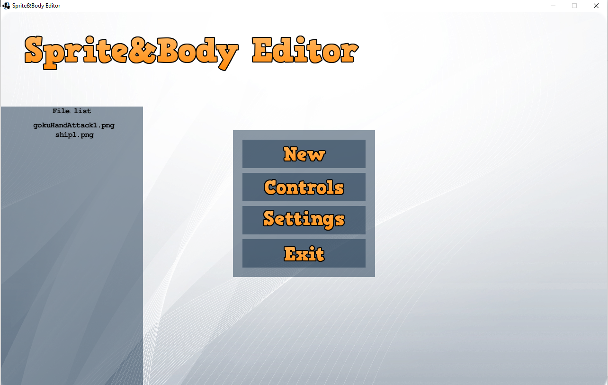
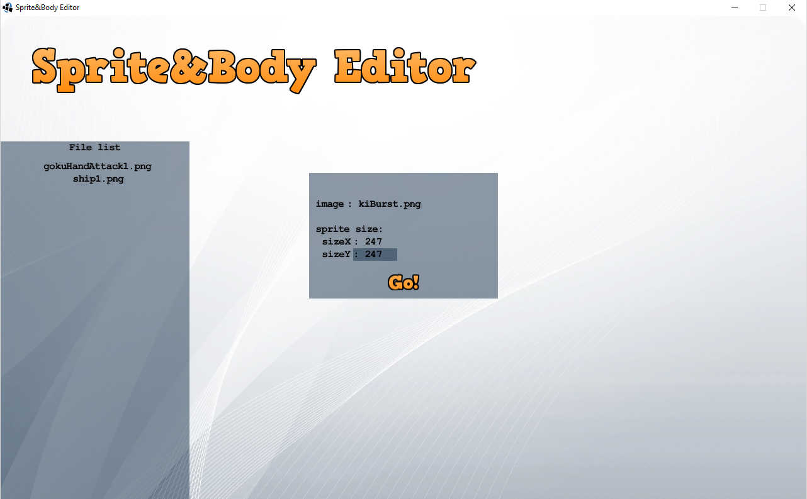
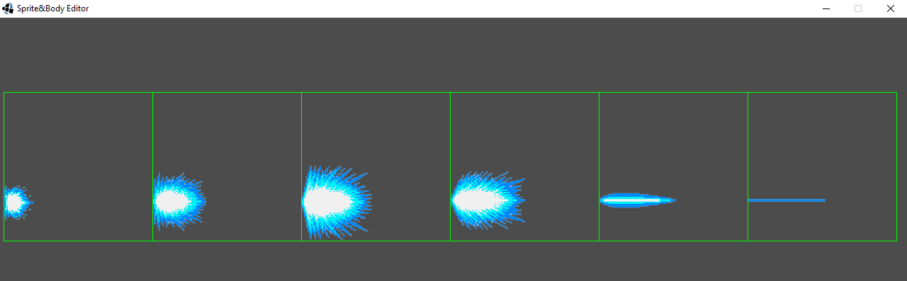
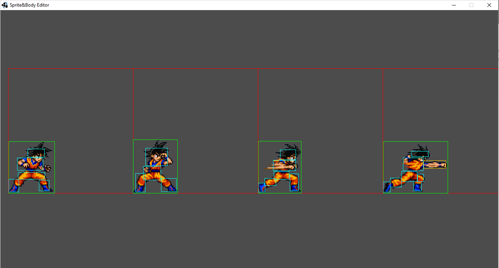

## Sprite&BodyEditor

This is a light software to edit 2D sprite hit boxes.

 - The tool allow you to create different type of hit boxes : attack / defense / block.
 - You are able to copy / paste hit boxes with shortcut
 - You can add and delete hit boxes
 - You can draw rectangles and circles

-------------------------------------------------------------------------------------------  
## Usage:  

- Main Screen :

- Create Sprite : add an image in the folder Sprite&Body and click **esc** on the main screen, click 'New' and select the file name and the size x/y of one sprite (not the size of the image).

- Add hitbox : click on **esc** and 'Controls' to see the controls, for example click **a** and with the mouse click, move and release in order to add a square.

